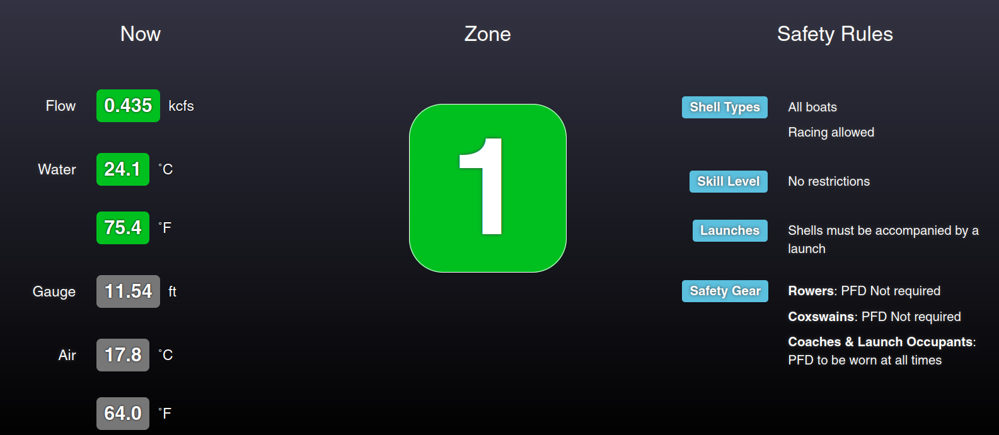

# RiverStatusBoard

RiverStatusBoard is a dashboard-style view of river conditions on a particular waterway designed for rowers, paddlers, boaters, and other water users to ensure safety out on the water.

## Development

This site does not fully work (API requests fail) when just opening the `index.html` directly in a browser. Instead it must be served over HTTP. Because this is a static/client side only website, any HTTP server that is able to serve static files can be used. Examples include:
- The built in python HTTP server: `python3 -m http.server`
- The built-in PHP HTTP server: `php -S localhost:8000`
- caddy: `caddy file-server --listen :8000`

### Unit tests

There are unit tests included in this site for some of the underlying data logic. To run them:

1. `npm install`
2. `npm test`

## Credits

RiverStatusBoad was [created in 2017/2018 by Max Garber](https://github.com/maxgarber/RiverStatusBoard) for the [Three Rivers Rowing Association](https://www.threeriversrowing.org/safety). It was then substantially built upon from 2023-2025 by Adrian Edwards, primarily to modularize the code such that it can scale beyond just usage for a single rowing club.